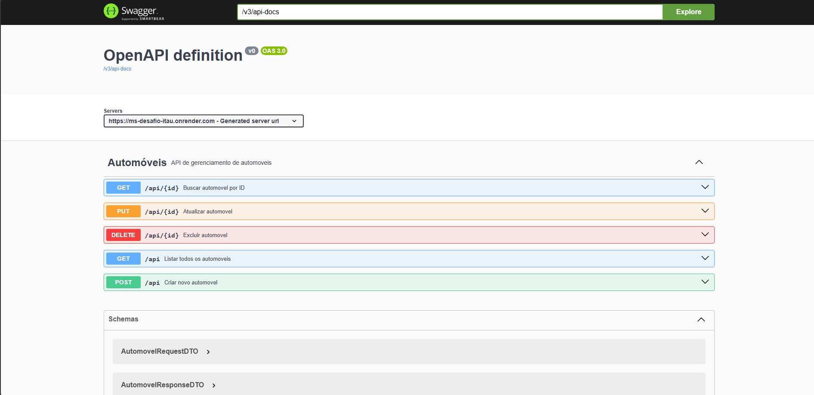

# Desafio Itau - gerenciador de automóveis

## Descrição do Projeto

Este projeto é um microsserviço que tem como objetivo gerenciar automóveis. Desse modo, é possível adicionar um carro, listar todos os carros ou listar um unico carro por id).

## Funcionalidades - endpoints

- **Cadastrar novo automóveis**: POST /api.
- **Consulta de automóvel por ID:** GET /api/{id};
- **Lista todos os automóveis:** GET /api;
- **Atualiza informações do usuário**: PUT /api/{id}; | será implementado (previsao: 02/06/2025)
- **Remove usuário**: DELETE /api/users/{id}; | será implementado (previsao: 02/06/2025)
- **Lista usuários com paginação:** GET /api/paged; | será implementado (previsao: 02/06/2025)

## Documentação 


## Estrutura do Projeto

```bash
docdoctor
├── src
│   ├── main
│   │   ├── java
│   │   │   └── com.itau.ms_desafio_itau
│   │   │       ├── MsDesafioItauApplication.java
│   │   │       ├── config
│   │   │       │   └── OpenApiConfig.java
│   │   │       ├── controller
│   │   │       │   └── AutomovelController.java
│   │   │       ├── dto
│   │   │       │   └── AutomovelRequestDTO.java
│   │   │       │   └── AutomovelResponseDTO.java
│   │   │       ├── entities
│   │   │       │   └── Automovel.java
│   │   │       ├── exception
│   │   │       │   └── GlobalExceptionHandler.java
│   │   │       │   └── ErrorResponse.java
│   │   │       ├── mapper
│   │   │       │   └── AutomovelMapper.java
│   │   │       ├── repository
│   │   │       │   └── AutomovelRepository.java
│   │   │       ├── service
│   │   │       │   └── user
│   │   │       │        └── IAutomovelrService.java
│   │   │       │        └── AutomovelServiceImpl.java
│   │   └── resources
│   │       └── application.properties
            └── data.sql
            └── schema.sql  
│   └── test
│       ├── java
│       │   └── com.itau.ms_desafio_itau
│       │       └── controller
│       │       │   └── AutomovelControllerIntegrationTest.java
│       │       └── service
│       │           └── AutomovelServiceImplTest.java
│       └── resources
└── pom.xml
 
```

## Passos para Executar o Projeto

### Pré-requisitos 

- **Java 17**
- **Maven 3.10.1+**

### Executar a Aplicação

1. Clone o repositório:

    ```bash
       git clone https://github.com/andresavasconcelos/ms-desafio-itau.git
       cd ms-desafio-itau
    ```

2. Compile:
    ```bash
      mvn clean install
    ```
3. Execute o projeto com Docker. Certifique que o Docker esteja instalado e executando
    ```bash
      cd docker
      docker-compose up --build
   ``` 
   *** Sem o docker ***
    ```bash
      mvn spring-boot:run
    ```

4. Acesse o serviço:

  - Serviço: `http://localhost:8080`
  - Banco de dados em memória: `http://localhost:8080/h2-console`
  - Documentação (Swagger UI): `http://localhost:8080/swagger-ui/index.html`


### Executar Testes

Para executar os testes unitários (ainda não está disponível):

   ```bash
     mvn clean test
   ```
## 📦 Dados de exemplo

Ao iniciar a aplicação, o banco H2 será preenchido com os seguintes automóveis:

| ID | Marca       | Nome           | Preço (R$)  |
|----|-------------|----------------|-------------|
| 1  | Toyota      | Corolla XEI    | 95.000,00   |
| 2  | Honda       | Civic Touring  | 105.000,00  |
| 3  | Chevrolet   | Onix LT        | 78.000,00   |
| 4  | Volkswagen  | Golf GTI       | 132.000,00  |

✅ Você pode consultar usando:
```sql
SELECT * FROM AUTOMOVEIS_TB 
```
